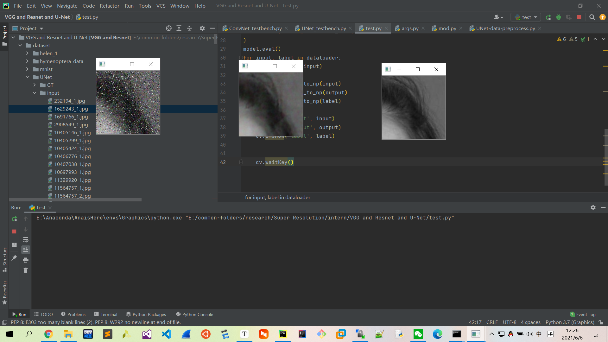
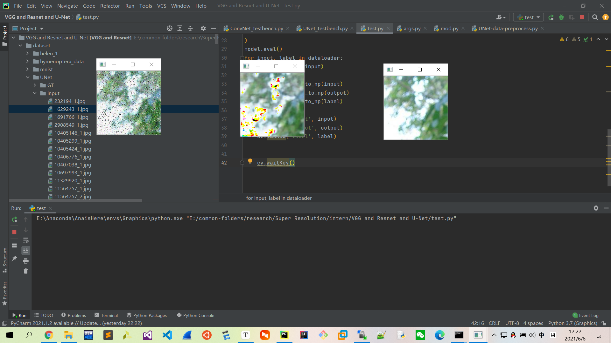

# UNet-for-Image-Denoising
Established a UNet model to deal with image denoising problem

## Resource

[[2015.5.18][U-Net] U-Net：Convolutional Networks for Biomedical Image Segmentation](https://arxiv.org/abs/1505.04597)

## Topic

- The repo established a whole pipeline for single image denoising task, and the backbone was the UNet model.

- UNet

  

## Content

1. Tailor the images dataset to 160*160.

2. Add the Gaussian-Noise and Salt-and-Pepper-Noise to all of the images.

3. Train the model.

4. See what we got.

   

## Details

- Our model basically followed the original version of the UNet paper. However, for the sake of computing resources and the intrinsic principal of the model, we fine tuned the size of input images to 160*160.
- Loss function: mse/L1.

## Future

- Deal with the color overflow problem.

  

- Calculate the PSNR and MISR of the output images.
- Make more credible denoised images.